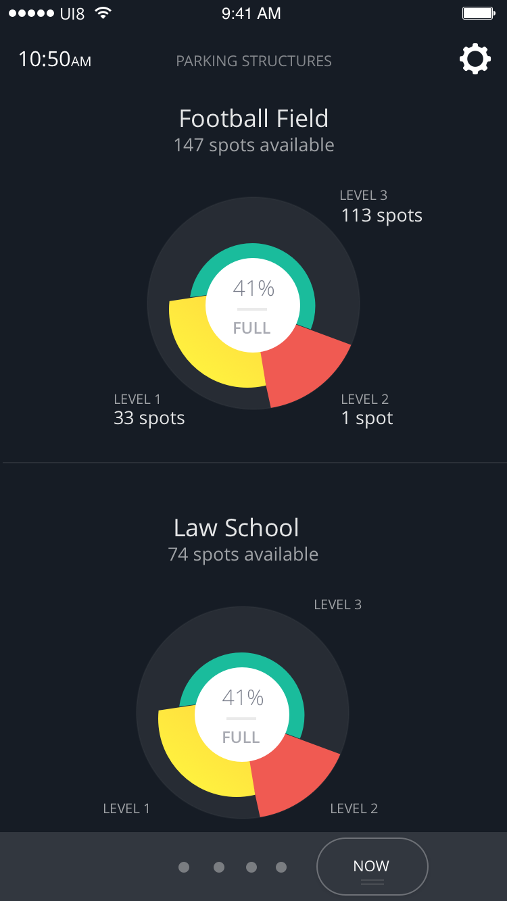

# CirclePieViewExample
Custom UIView for showing data in a pie chart form

Tutorial: [Lets create a custom UIView Circle Indicator](https://medium.com/@jacks205/lets-create-a-custom-uiview-circle-indicator-in-swift-ec5a2b993dec)

Tutorial for showing how to make a view similar to the Spots custom view

